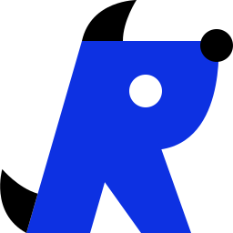

# Rebel Engine

  

Rebel Engine is a cross-platform game engine and game development tool for creating desktop (Windows, Linux and MacOS), mobile (Android and iPhone) and web games (HTML5).

## Background

Rebel Engine is based on [Godot Engine](https://godotengine.org), but developed with different priorities. The Rebel Engine development philosophy is:

  * Focus on the needs of the game developer before the engine developer
  * Fix bugs before writing new code
  * Write maintainable code that follows [C++ Core Guidlines](https://isocpp.github.io/CppCoreGuidelines/CppCoreGuidelines)
  * Reduce existing [technical debt](https://en.wikipedia.org/wiki/Technical_debt)

Rebel Engine was forked from [Godot 3.4.5](https://github.com/godotengine/godot/tree/3.4.5-stable) in 2023. This version was chosen as the basis for Rebel Engine, because it was a stable and reliable version used to develop many published games.

## Free and Open Source Software

Rebel Engine is Free and Open Source Software; released under the [MIT license](https://mit-license.org/). Games developed with Rebel Engine remain entirely the property of the game developer.

## Documentation

Rebel Toolbox user documentation, including the Rebel Engine API documentation, is available at https://docs.rebeltoolbox.com.

Rebel Toolbox documenation is maintained via the [Rebel Documentation](https://github.com/RebelToolbox/RebelDocumentation) repository.
The Rebel Engine API documentation is maintained here via XML files in the [`docs`](https://github.com/RebelToolbox/RebelEngine/tree/main/docs) folder.

Rebel Toolbox translations are maintained via our [Weblate project](https://hosted.weblate.org/engage/rebel-toolbox/).
